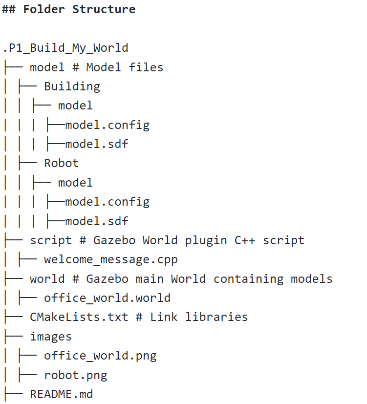
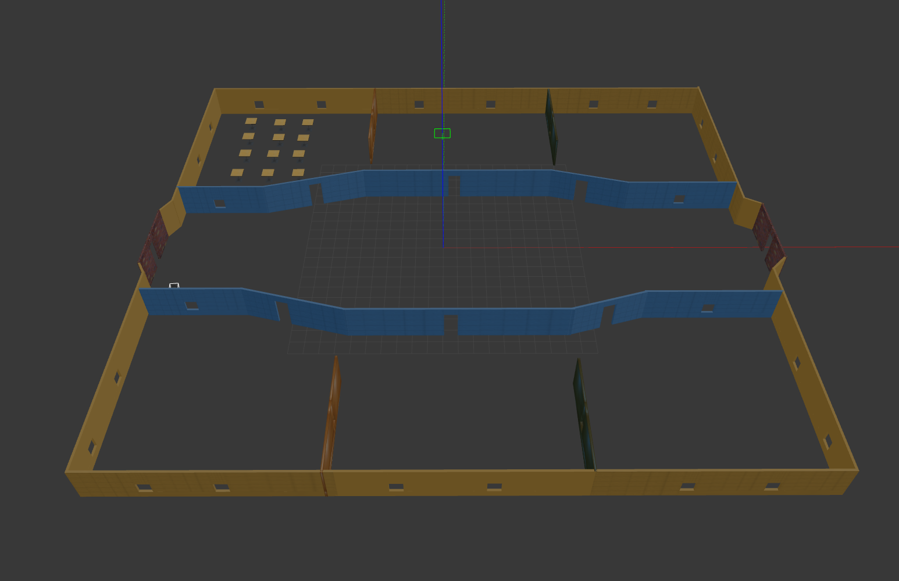
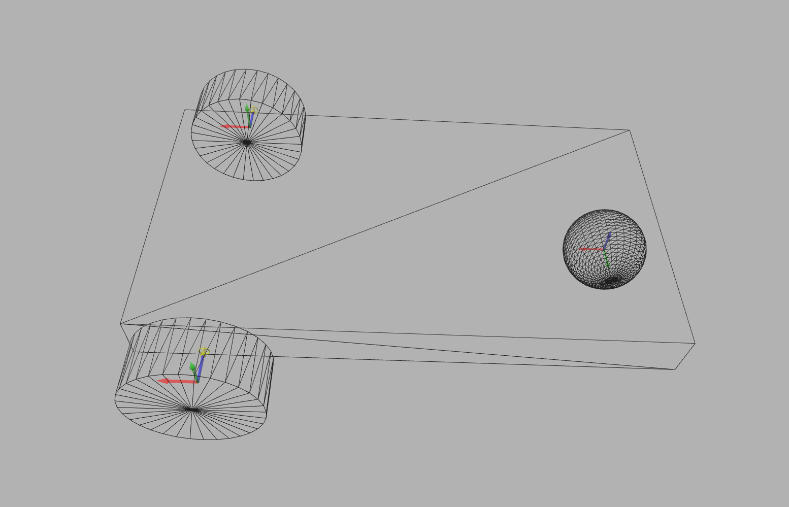

# Udacity Robotics Software Engineering Nanodegree Program Project 1
# Build_My_World

## Introduction
This project includes create a simulation world, designing a robot, housing it inside the world. 

## Summary of Tasks	
1. Build a single floor wall structure using the Building Editor tool in Gazebo. 
Apply at least one feature, one color, and optionally one texture to your structure. 
Make sure there's enough space between the walls for a robot to navigate.
2. Model any object of your choice using the Model Editor tool in Gazebo. Your model links should be connected with joints.
3. Import your structure and two instances of your model inside an empty Gazebo World.
4. Import at least one model from the Gazebo online library and implement it in your existing Gazebo world.
5. Write a C++ World Plugin to interact with your world. Your code should display “Welcome to ’s World!” message as soon as you launch the Gazebo world file.

## Folder Structure

# Results

## Office World

## Robot

