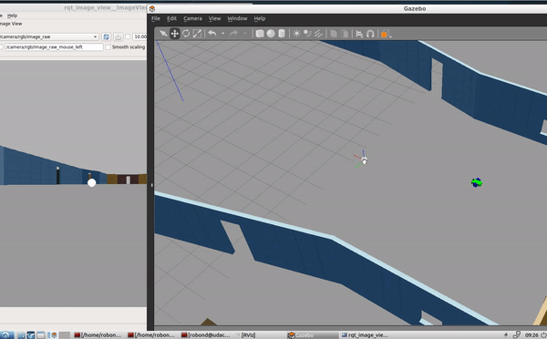

# Udacity Robotics Software Engineering Nanodegree Program Project 2
# Go_Chase_It

## Prerequisites
	
Install Gazebo : http://gazebosim.org/

Install ROS : http://wiki.ros.org/ROS/Installation
	
## Introduction

This project involves two main ROS packages in catkin_ws/src: the drive_bot and the ball_chaser. 
Here are the steps that design the robot, house it inside the world, and program it to chase white-colored balls:

drive_bot:
1. Create a my_robot ROS package to hold a robot, the white ball, and the world. 
2. Design a differential drive robot with the URDF. 
3. Add two sensors to the robot: a lidar and a camera. 
4. Add Gazebo plugins for the robot’s differential drive, lidar, and camera. 

Re-use te world that I built in the "P1_Build_My_World" project and house the robot inside that world.
Add a white-colored ball to Gazebo world and save a new copy of this world.
The world.launch file will launch the world with the white-colored ball and the robot.

ball_chaser:
1. Create a ball_chaser ROS package to hold C++ nodes.
2. Write a drive_botC++ node that will provide a ball_chaser/command_robot service to drive the robot by controlling its linear x and angular z velocities. 
The service should publish to the wheel joints and return back the requested velocities.
3. Write a process_image C++ node that reads robot’s camera image, analyzes it to determine the presence and position of a white ball. 
If a white ball exists in the image, the node should request a service via a client to drive the robot towards it.
The ball_chaser.launch will run both the drive_bot and the process_image nodes.


## Build and Run the project 

1. Create and initialize catkin_ws
```
$ mkdir -p /home/workspace/catkin_ws/src 
$ cd /home/workspace/catkin_ws/src
$ catkin_init_workspace
```

2. Clone or download the repository
```
$ git clone git@github.com:lily-aung/Robotics-Software-Engineer-Nanodegree.git
$ cp -R Robotics-Software-Engineer-Nanodegree/P2_Go_Chase_It/my_robot /home/workspace/catkin_ws/src
$ cp -R Robotics-Software-Engineer-Nanodegree/P2_Go_Chase_It/ball_chaser /home/workspace/catkin_ws/src
$ rm -rf Robotics-Software-Engineer-Nanodegree
```

3. Back to ```catkin_ws/``` Build the project

```
$ cd /home/workspace/catkin_ws/
$ catkin_make
```
4. Launch world file
Open 3 terminals the first one for launching my_robot & world , second one for ball_chaser, the last one for visualize the rqt_image_view.
In 1st terminal, 
```
$ source devel/setup.bash
$ roslaunch my_robot world.launch
```
In 2nd terminal, run rqt_image_view to visualize the camera stream.

```
$ source devel/setup.bash
$ rosrun rqt_image_view rqt_image_view 
```

The last terminal will be used to run the ball_chaser package.
```
$ source devel/setup.bash
$ roslaunch ball_chaser ball_chaser.launch
```
## Folder Structure

Now it's all set. 
Use the mouse to place the white ball at different positions in front of the robot and now the robot will be chasing the ball :)


## Result



Complete video on youtube: https://youtu.be/ghSEWDT0KWc
