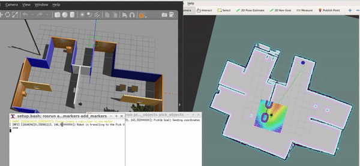

## Udacity Robotics Software Engineering Nanodegree Program Project 5
# Home Service Robot Project

Goal : A Home service robot is tasked to map the environment and navigate autonomously to pick up and drop virtual objects at designated locations.

* **Simulation Setup** : Design a simulation environment with the Building Editor in Gazebo and load the robot in the world.
* **Mapping** : Drives the robot to manually test SLAM and create a functional map of the environment for localization and navigation tasks, and save the GENERATED MAP.
* **Localization and Navigation** : Use the ROS navigation stack and manually command the robot to move to two different designated locations using 2D Nav Goal arrow in rviz.
* **Pick_objects** : Pick_objects is a node that sends multiple goals for the robot to reach.
* **Add_markers** : Add_markers is a node that subscribes the robot odometry, tracks robot poses, and publishes markers to rviz.
* **HomeService** : Run all the nodes in this project.

## Folder Structure
```
catkin_ws/src
    ├── slam_gmapping                  # gmapping_demo.launch file                   
    │   ├── gmapping
    │   ├── ...
    ├── turtlebot                      # keyboard_teleop.launch file
    │   ├── turtlebot_teleop
    │   ├── ...
    ├── turtlebot_interactions         # view_navigation.launch file      
    │   ├── turtlebot_rviz_launchers
    │   ├── ...
    ├── turtlebot_simulator            # turtlebot_world.launch file 
    │   ├── turtlebot_gazebo
    │   ├── ...
    ├── map                          
    │   ├── myMap.pgm                  # map files ->  generated map files using gmapping
    │   ├── myMap.yaml           	   
    ├── worlds                          
    │   ├── new_office_world.world     # world file
    ├── scripts                        # shell scripts files
    │   ├── test_slam.sh               # manually test SLAM (Simultaneous localization and mapping)
	│   ├── test_navigation.sh     # launch it for manual navigation test using 2D Nav Goal 
	│   ├── pick_objects.sh        # send multiple goals for the robot to reach
	│   ├── add_marker.sh          # publish a marker to rviz
	│   ├── home_service.sh        # home_service launch file
    ├──RvizConfig                      # rviz configuration file for HomeServiceRobot
    │   ├── home_service.rviz
    ├──pick_objects                    # pick_objects C++ node
    │   ├── src/pick_objects.cpp
    │	│   ├── CMakeLists.txt
    │   ├── ...
    ├──add_markers                     # add_markers C++ node
    │   ├── src/add_markers.cpp
    │   ├── src/add_markers_test.cpp
    │	│   ├── CMakeLists.txt	
    │   ├── ...
    └──
```

## Tasks

### Mapping
[gmapping](http://wiki.ros.org/gmapping) was used to make a map of the Gazebo environment. 

Run the `test_slam.sh` script to drive the robot in the gazebo environment using keyboard_teleop and generates the corresponding 2D map in the rviz. 
It took around 15 minutes to get full map for my `src/worlds/new_office_world.world`. After the full map is generated , use`rosrun map_server map_saver -f my_map` to save the generated map. 
And put `myMap.yaml`  under `src/map/'.
<p align="center">
  
</p> 
This map will be used for localization and navigation tasks.

### Localization and Navigation

[Adaptive Monte Carlo Localization (AMCL) ROS package](http://wiki.ros.org/amcl) is used in the project for robot `Localization` and [ROS Navigation stack](http://wiki.ros.org/navigation) is used for ` Path Planning`. 
Run the `test_navigation.sh` for robot manual navigation test in the generated mapp using `2D Nav Goal` in RViz workspace.

### Home Service Functions

`pick_objects.sh` - robot navigates autonomously to the pick up and drop off zone and publish the action messages for add_makers node.
`add_marker.sh` - Add and delete marker at designated locations (Pickup / drop off). This node subscribes to action messages from pick_objects node to acknowledge the action (pick up/drop off) , and also subscribes to the robot's odometry to determine if the robot has reached the designated location by calculating distance between the robot's pose and the predefined marker location (i.e Designated location).

`home_service.sh` file that will run all the nodes in this project and thus home service robot will be simulated as follow:<br/>
a. Initially show the marker at the pickup zone.<br/>
b. Hide the marker once your robot reach the pickup zone.<br/>
c. Wait 5 seconds to simulate a pickup.<br/>
d. Show the marker at the drop off zone once the robot reaches it.

## Build and Run the project 	

1. Create catkin workspace:
```sh
$ mkdir -p ~/catkin_ws/src
$ cd ~/catkin_ws/src
$ catkin_init_workspace
$ cd ~/catkin_ws
$ catkin_make
```

2. There are four packages required to install for the project.

- [slam_gmapping](http://wiki.ros.org/slam_gmapping) : perform SLAM and build a map of the environment with a robot equipped with laser range finder sensors or RGB-D cameras.
- [turtlebot](http://wiki.ros.org/turtlebot) : manually control a robot using keyboard commands.
- [turtlebot_interactions](http://wiki.ros.org/turtlebot_interactions) : launcher scripts for RViz workspace.
- [turtlebot_simulator](http://wiki.ros.org/turtlebot_simulator) : deploys a turtlebot in a gazebo environment.

Clone the required repositories to catkin_ws/src as follows:
```sh
$ cd ~/catkin_ws/src
$ git clone https://github.com/ros-perception/slam_gmapping.git
$ git clone https://github.com/turtlebot/turtlebot.git
$ git clone https://github.com/turtlebot/turtlebot_interactions.git
$ git clone https://github.com/turtlebot/turtlebot_simulator.git
```
Install package dependencies with `rosdep install [package-name]`

3. Clone the content of this repository to catkin_ws/src
```sh
$ git clone https://github.com/lily-aung/Robotics-Software-Engineer-Nanodegree.git
$ cp -R Robotics-Software-Engineer-Nanodegree/P5_HomeServiceRobot ~/catkin_ws/src
$ rm -rf Robotics-Software-Engineer-Nanodegree

```
4. Source and build the project:
```sh
$ cd ~/catkin_ws
$ source devel/setup.bash
$ catkin_make
```

4. Make scripts to executable:
```sh
$ cd ~/catkin_ws/src/scripts
$ chmod +x test_slam.sh
$ chmod +x test_navigation.sh
$ chmod +x pick_objects.sh
$ chmod +x add_markers.sh
$ chmod +x home_service.sh
```
5. Run `./home_service.sh` in `scripts` directory to deploy the home service robot.


Pick Up            |  Drop Off
:-------------------------:|:-------------------------:
  |  

Complete video on youtube: https://youtu.be/QKF8CoiBD2s
